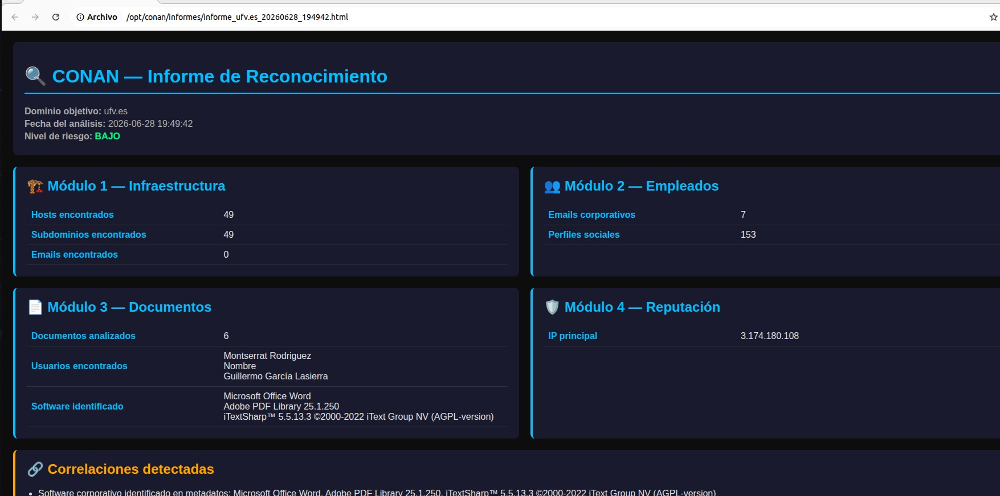
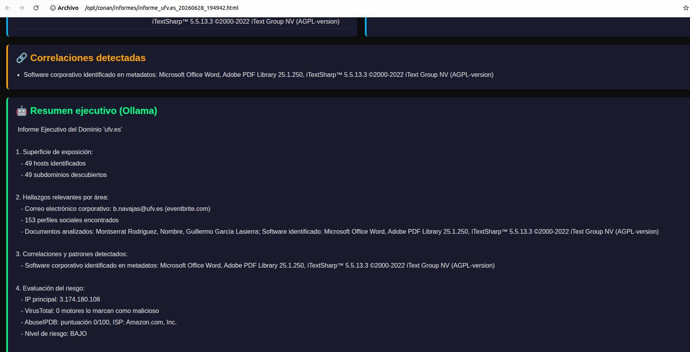

# 🔍 CONAN
### Corporate Open-source Network ANalysis

**Distribución Linux OSINT orientada al reconocimiento de empresas y organizaciones**

*Trabajo de Fin de Máster — Máster en Ciberseguridad · Campus Internacional de Ciberseguridad*

---

## ¿Qué es CONAN?

CONAN es una distribución Linux especializada en la recopilación automatizada de información pública sobre empresas y organizaciones (reconocimiento pasivo / OSINT corporativo). A diferencia de otras herramientas similares orientadas a personas, CONAN se centra exclusivamente en el objetivo corporativo: infraestructura, empleados, documentos expuestos y reputación.

El sistema automatiza cuatro módulos de reconocimiento y genera un **informe ejecutivo en HTML** mediante un modelo de lenguaje local (Ollama + Mistral 7B), sin depender de servicios en la nube para el análisis.

---

## Módulos

| # | Módulo | Herramientas | Qué obtiene |
|---|--------|-------------|-------------|
| 1 | **Infraestructura** | theHarvester, Amass | Hosts y subdominios expuestos |
| 2 | **Empleados** | theHarvester, Holehe, Maigret | Emails corporativos y perfiles en servicios online |
| 3 | **Documentos** | DuckDuckGo scraper, Exiftool | Metadatos de documentos públicos (autores, software, fechas) |
| 4 | **Reputación e Inteligencia** | VirusTotal, AbuseIPDB, URLScan.io | Análisis de reputación del dominio e IP, nivel de riesgo |

Al finalizar, el **consolidador** cruza los datos de los cuatro módulos, detecta correlaciones y genera un informe HTML con análisis ejecutivo mediante IA local.

---

## Características principales

- **Automatización completa**: un solo comando lanza todos los módulos secuencialmente
- **IA local**: generación del informe ejecutivo con Ollama + Mistral 7B, sin enviar datos a la nube
- **Informes HTML profesionales**: diseño oscuro con paleta cian/naranja/verde, listos para presentar
- **Correlaciones automáticas**: detecta coincidencias entre usuarios en metadatos, emails y perfiles sociales
- **API keys opcionales**: todos los módulos funcionan en modo gratuito sin configuración adicional
- **Distribuida como OVA**: lista para importar en VirtualBox, sin instalación

---

## Herramientas incluidas

Además de los módulos propios de CONAN, la distribución incluye:

- **Maltego** — análisis de relaciones y grafos OSINT
- **SpiderFoot** — reconocimiento automatizado multipropósito
- **Wireshark** — análisis de tráfico de red
- **Nmap** — escaneo de puertos y servicios
- **Tor Browser** — navegación anónima para investigación
- Firefox y Chrome con **marcadores OSINT** organizados por categorías

---

## Ejemplo de informe

Los informes generados incluyen:
1. Superficie de exposición del dominio
2. Hallazgos relevantes por área
3. Correlaciones y patrones detectados
4. Evaluación del riesgo (BAJO / MEDIO / ALTO)
5. Recomendaciones específicas
